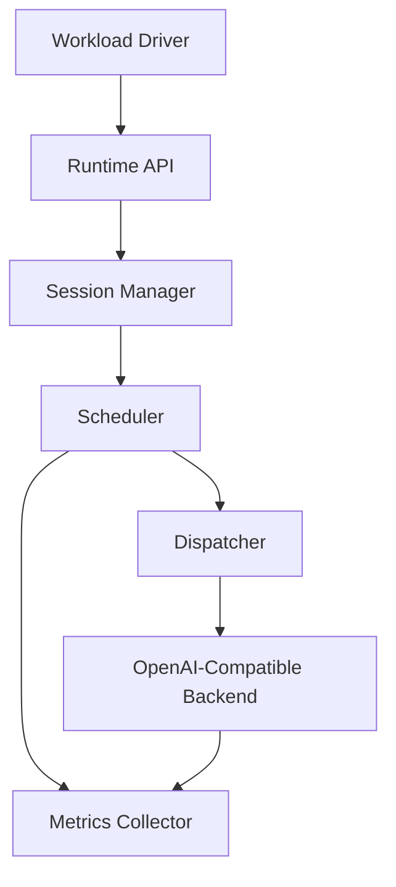
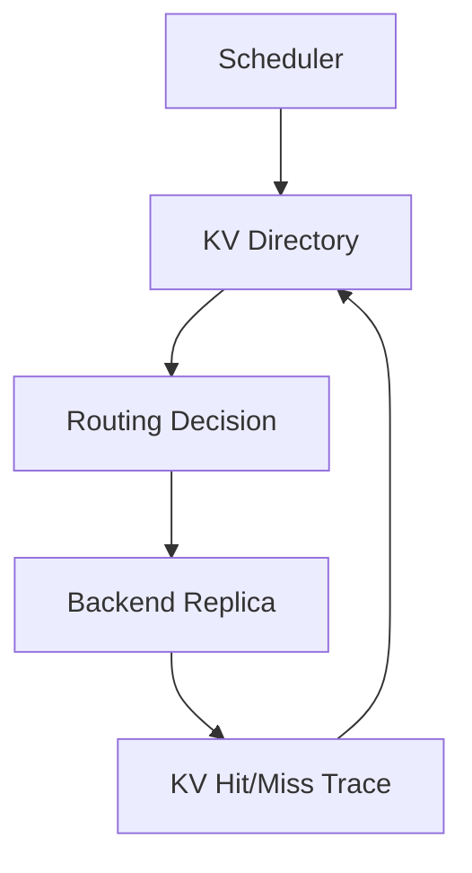
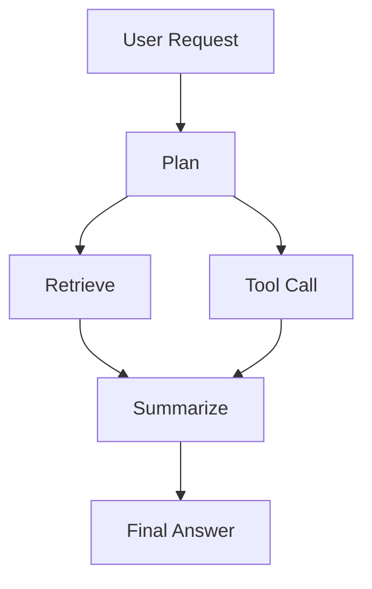

# Project Plan: Session-Aware LLM Runtime

## 1. Project Overview

This project builds a C++ runtime and scheduling framework for LLM serving workloads, especially multi-turn chat, agent workflows, RAG, and background batch tasks.

The core idea is to move LLM serving optimization from request-level scheduling to session-aware, task-aware, workload-aware runtime control.

Traditional LLM serving systems mainly optimize batching, token throughput, KV memory layout, and single-request inference efficiency. This project focuses on a higher-level problem: modern LLM applications are organized around sessions, workflows, agent loops, deadlines, priorities, and cache reuse opportunities. The runtime should understand these signals and use them to make better scheduling, routing, admission, and cache decisions.

## 2. Core Problem

LLM serving workloads are no longer just independent prompt-completion requests. Real workloads include:

- Multi-turn chat sessions
- Agent workflows with multiple dependent LLM calls
- RAG pipelines with long prompts and short outputs
- Tool-use loops with repeated resume behavior
- Background summarization or evaluation jobs
- Mixed interactive and batch traffic
- Requests with different latency targets and priorities

Existing serving systems are strong at backend-level inference optimization, but they often treat requests as isolated units. This creates several problems:

- Interactive requests can be delayed behind long background generations.
- Agent steps suffer high resume latency when re-entering the model.
- Session history and KV reuse value are not directly reflected in scheduling.
- SLO and deadline targets are difficult to enforce under mixed workloads.
- Cache eviction and routing decisions are usually disconnected from task semantics.
- Benchmarking often focuses on throughput instead of session-level latency and workflow completion time.

This project addresses these gaps by introducing a runtime layer that understands session state, task class, workload mix, SLO targets, and eventually KV cache value.

## 3. High-Level Goals

| Goal | Description |
|---|---|
| Reduce TTFT | Improve time to first token for interactive chat and user-facing requests. |
| Reduce resume latency | Improve latency when a session or agent workflow re-enters the model. |
| Reduce P95/P99 latency | Reduce long-tail latency under mixed workloads. |
| Improve SLO satisfaction | Increase the fraction of requests completed before deadline. |
| Preserve throughput | Improve latency without collapsing tokens/sec or requests/sec. |
| Improve scheduling quality | Compare FIFO, priority, SLO-aware, session-aware, and hybrid policies. |
| Support realistic benchmarks | Use chat, agent, RAG, batch, burst, and long-context workload mixes. |
| Extend into KV-aware runtime | Use cache metadata, hit/miss tracing, and retention policies in V2. |

## 4. Main Innovation Points

## 4.1 Session-Aware Scheduling

The runtime treats each request as part of a session rather than an isolated job.

Session-level signals include:

| Signal | Purpose |
|---|---|
| `session_id` | Groups related LLM calls. |
| `last_active_ts` | Tracks recent activity. |
| `resume_count` | Identifies sessions that repeatedly re-enter the model. |
| `priority` | Encodes user class or business priority. |
| `deadline_ms` | Enables SLO-aware scheduling. |
| `interactivity_score` | Marks user-facing latency-sensitive requests. |
| `task_type` | Distinguishes chat, agent, RAG, batch, summarization, and code generation. |
| `kv_hint` | Indicates whether cache reuse is expected. |

Scheduling decisions can use these signals to prioritize active sessions, reduce resume latency, and prevent background jobs from hurting interactive latency.

## 4.2 Task-Aware Scheduling

Different LLM tasks have different cost profiles and latency goals.

| Task Type | Serving Pattern | Primary Objective |
|---|---|---|
| Chat turn | Short to medium prompt, user waits for first token | TTFT |
| Agent step | Multi-step workflow, repeated resume | Resume latency and workflow latency |
| RAG answer | Long retrieved context, shorter answer | Prefill efficiency |
| Summarization | Long input, short output | Prefill scheduling |
| Code generation | Medium prompt, long output | Decode throughput |
| Batch eval | Many independent background requests | Throughput |

The scheduler should apply different scoring and queueing behavior depending on task class.

## 4.3 Workload-Aware Scheduling

The runtime observes system state and adapts policy behavior.

Runtime signals include:

| Signal | Usage |
|---|---|
| Queue depth | Detect congestion. |
| Active sessions | Measure session contention. |
| Active token streams | Estimate decode pressure. |
| Prefill queue length | Detect prompt-processing bottlenecks. |
| Decode queue length | Detect generation bottlenecks. |
| GPU utilization | Detect underutilization or overload. |
| KV usage | Detect cache pressure in V2. |
| TTFT/P99 trends | Trigger adaptive policy changes. |
| Deadline miss rate | Adjust SLO urgency. |
| Task mix | Shift between latency-oriented and throughput-oriented behavior. |

## 4.4 KV-Aware Runtime

V2 connects runtime policy to KV cache behavior.

The runtime should track:

- Which session owns which KV blocks
- Which prefixes are reusable
- Which backend contains the relevant KV
- Which KV blocks are worth preserving
- Which evictions cause expensive recomputation
- How much prefill work is saved by cache hits

This enables cache-aware routing, retention, eviction, and offload policies.

## 5. Architecture



V2 extends this with KV metadata and cache-aware routing:



## 6. V1 Scope

V1 is a C++ session-aware scheduler with real or mock OpenAI-compatible backend integration.

The goal of V1 is to establish a working benchmark harness and prove that session-aware scheduling improves TTFT, resume latency, P99 latency, and SLO satisfaction under mixed workloads.

## 6.1 V1 Core Features

| Feature | Description | Priority |
|---|---|---|
| `SessionState` | Stores session id, priority, deadline, task class, activity, and resume metadata. | P0 |
| `RequestState` | Stores prompt token estimate, output token estimate, arrival time, and request status. | P0 |
| `RuntimeState` | Stores queue depth, active streams, backend load, and policy metrics. | P0 |
| `SessionManager` | Creates, updates, and looks up sessions. | P0 |
| Scheduler interface | Allows multiple scheduling policies to share one API. | P0 |
| FIFO policy | Baseline policy. | P0 |
| Priority policy | Prioritizes high-priority requests. | P0 |
| SLO-aware policy | Prioritizes requests close to deadline. | P0 |
| Session-aware hybrid policy | Combines deadline, wait time, priority, interactivity, resume bonus, and cost. | P0 |
| Dispatcher | Sends requests to backend and tracks lifecycle. | P0 |
| Mock backend | Enables deterministic unit tests and fast policy debugging. | P0 |
| OpenAI-compatible backend adapter | Supports vLLM, SGLang, llama.cpp server, or similar backend. | P0 |
| Streaming TTFT measurement | Records time from request arrival to first token. | P0 |
| Metrics collector | Records latency, TTFT, queue time, tokens/sec, and SLO miss rate. | P0 |
| Trace logger | Emits per-request and per-decision logs. | P1 |
| JSON workload loader | Loads synthetic or trace-driven workload definitions. | P1 |
| CLI benchmark runner | Runs repeatable benchmark experiments. | P1 |

## 6.2 V1 Scheduling Policies

### FIFO Baseline

Requests are processed in arrival order.

Purpose:

- Establish the simplest baseline
- Measure default queueing behavior
- Provide a reference for all later policies

### Priority Scheduling

Requests are ordered by explicit priority.

Purpose:

- Improve latency for interactive or high-value sessions
- Test whether static priority alone is enough

### SLO-Aware Scheduling

Requests are scored by deadline urgency.

Example:

```cpp
double deadline_urgency(const RequestState& req, int64_t now_ms) {
    auto remaining = req.deadline_ms - now_ms;
    return 1.0 / std::max<int64_t>(remaining, 1);
}
```

Purpose:

- Reduce deadline miss rate
- Understand tradeoffs between throughput and deadline satisfaction

### Session-Aware Hybrid Policy

Hybrid score:

```cpp
score =
    w_deadline * deadline_urgency
  + w_waiting * waiting_ms
  + w_priority * priority
  + w_interactive * interactivity_score
  + w_resume * resume_bonus
  - w_cost * estimated_token_cost;
```

Purpose:

- Improve interactive TTFT
- Improve resume latency
- Avoid starvation through waiting-time aging
- Balance latency-sensitive and throughput-oriented work

## 6.3 V1 Backend Plan

V1 should use an OpenAI-compatible backend first because it keeps backend integration simple and lets the project focus on runtime policy.

Recommended backend order:

| Backend | Use |
|---|---|
| Mock backend | Unit tests and deterministic benchmarks. |
| vLLM OpenAI server | Main real-serving benchmark backend. |
| SGLang server | Useful bridge toward V2 cache-aware work. |
| llama.cpp server | Lightweight local testing. |

V1 should avoid relying on internal KV cache hooks. Those belong to V2.

## 7. V2 Scope

V2 extends the scheduler into a KV-aware runtime.

The goal of V2 is to connect scheduling decisions with KV cache locality, retention, eviction, hit/miss tracing, and recomputation accounting.

## 7.1 V2 Core Features

| Feature | Description | Priority |
|---|---|---|
| `KVHandle` | Identifies a cache block or prefix region. | P0 |
| `KVMetadata` | Tracks session id, prefix hash, token range, backend id, size, and last-used time. | P0 |
| KV directory | Maps session/prefix to backend-local KV state. | P0 |
| KV hit/miss tracing | Records whether a request reused existing KV. | P0 |
| Recompute token accounting | Counts tokens recomputed because of cache misses or evictions. | P0 |
| LRU baseline | Baseline cache eviction policy. | P0 |
| Session-aware retention | Preserves KV for active or frequently resumed sessions. | P0 |
| Cost-aware retention | Preserves KV with high recomputation cost. | P1 |
| KV locality-aware routing | Routes requests to backends with matching KV when beneficial. | P1 |
| KV eviction simulator | Tests cache policies before backend patching. | P1 |
| KV pinning | Temporarily protects high-value KV. | P2 |
| KV offload policy | Moves colder KV to CPU or disk. | P2 |
| Adaptive KV policy | Adjusts retention behavior based on hit rate and memory pressure. | P2 |

## 7.2 V2 KV Value Score

Example:

```cpp
kv_value =
    w_reuse * predicted_reuse_probability
  + w_cost * recompute_token_cost
  + w_priority * session_priority
  + w_deadline * deadline_urgency
  + w_recent * recency_score
  - w_memory * kv_memory_size;
```

The policy should preserve KV blocks with high future value and evict low-value blocks under memory pressure.

## 7.3 V2 Backend Options

| Backend | Value |
|---|---|
| vLLM internal KV cache manager | Mature serving backend, useful for practical integration. |
| SGLang HiCache / RadixAttention | Strong fit for prefix reuse and agent workloads. |
| TensorRT-LLM Executor | High-performance production serving direction. |
| LMCache | Specialized KV reuse and offload layer. |
| Custom patched backend | Highest research freedom. |

V2 should start with a KV eviction simulator, then move to one real backend integration.

## 8. Extended Features

## 8.1 Adaptive Policy Tuner

The scheduler adjusts weights based on runtime metrics.

| Observed Signal | Action |
|---|---|
| TTFT P99 increases | Increase interactive and short-prefill weight. |
| Deadline miss rate increases | Increase deadline urgency weight. |
| Resume latency increases | Increase session affinity and resume bonus. |
| GPU utilization drops | Allow larger batches or reduce latency bias. |
| Queue depth grows | Enable admission control or degradation. |
| Batch throughput drops | Reduce aggressive interactive boosting. |

Implementation levels:

| Level | Method |
|---|---|
| L1 | Rule-based adaptation |
| L2 | Offline grid search |
| L3 | Bayesian optimization |
| L4 | Contextual bandit |
| L5 | RL-based scheduler |

Recommended first version: rule-based adaptation with explicit thresholds.

## 8.2 Admission Control

When the system is overloaded, the runtime decides how to handle new requests.

Actions:

- Admit
- Delay
- Reject
- Degrade max output tokens
- Route to fallback backend
- Apply per-class queue limits
- Apply per-session quota

This feature makes the runtime responsible for service quality rather than only queue ordering.

## 8.3 Model and Backend Routing

If multiple backends exist, the runtime chooses where each request should run.

| Request Type | Routing Preference |
|---|---|
| Short chat | Low-latency backend |
| Long output | High-throughput backend |
| Background batch | Cheap or slower backend |
| Agent step | Low resume latency backend |
| Code generation | Larger or specialized model |
| Retry | Fallback backend |

V2 adds KV-locality-aware routing.

## 8.4 Session Affinity

Keep the same session on the same backend when beneficial.

Benefits:

- Higher cache locality
- Lower resume latency
- Easier trace analysis
- More stable backend behavior

Fallback behavior should still handle backend overload.

## 8.5 Soft Preemption

Long-running generations can yield after a token budget or time slice.

Supported behavior:

- Stop after N generated tokens
- Requeue continuation request
- Allow high-priority request to run
- Resume paused generation later

This is useful for preventing long background generations from blocking interactive traffic.

## 8.6 Agent Workflow Workload

The benchmark should model full agent workflows instead of only independent requests.

Example workflow:

```text
User request
-> planner LLM call
-> tool selection LLM call
-> tool execution
-> summarizer LLM call
-> verifier LLM call
-> final answer LLM call
```

Metrics:

- Workflow latency
- Step latency
- Critical-path latency
- Resume latency between steps
- Wasted work after cancellation
- Tool wait time

## 8.7 DAG-Based Workflow Scheduling

Agent workflows can be represented as DAGs.



The scheduler can use:

- Critical path priority
- Dependency-aware readiness
- Parallel branch limits
- Deadline propagation
- Downstream cancellation

This is a strong research extension because it expands from request scheduling to workflow scheduling.

## 8.8 Trace Viewer

A dashboard or HTML report should show:

- Request timeline
- Session timeline
- Queue waiting time
- Prefill and decode phases
- Policy score breakdown
- Backend load
- TTFT/P95/P99 charts
- Deadline miss distribution
- KV hit/miss and eviction events in V2

The trace viewer improves debugging, evaluation, and project presentation.

## 9. Benchmark Plan

## 9.1 V1 Policy Benchmarks

| Benchmark | Comparison | Main Metrics |
|---|---|---|
| FIFO baseline | FIFO only | TTFT, latency, throughput |
| Priority vs FIFO | Static priority improvement | Interactive TTFT, fairness |
| SLO-aware vs FIFO | Deadline-aware improvement | Deadline miss rate, P99 |
| Session-aware vs FIFO | Session behavior improvement | Resume latency, session P99 |
| Hybrid vs all baselines | Combined policy value | TTFT, resume latency, P99, throughput |
| Adaptive vs static hybrid | Tuning value | Stability under workload shifts |

## 9.2 Workload Benchmarks

| Workload | Composition | Purpose |
|---|---|---|
| Chat-heavy | 80% chat, 20% background | Interactive latency |
| Agent-heavy | Multi-step sessions with frequent resume | Resume latency |
| RAG-heavy | Long prompt, short output | Prefill pressure |
| Batch-heavy | Many background jobs | Throughput |
| Mixed realistic | Chat + agent + RAG + batch | General evaluation |
| Burst traffic | Sudden arrival spike | Queue stability |
| Long-context | Very long prompts | Prefill and cache value |
| Long-output | Long generations | Decode pressure |

## 9.3 V2 Cache Benchmarks

| Benchmark | Comparison | Main Metrics |
|---|---|---|
| LRU baseline | LRU only | Hit rate, eviction count |
| Session-aware KV vs LRU | Active session retention | Resume latency, session hit rate |
| Cost-aware KV vs LRU | High-cost KV retention | Recomputed tokens |
| Task-aware KV vs LRU | Agent/chat retention | Workflow latency |
| KV-locality routing vs load-only routing | Cache-aware routing | Prefill savings, load balance |
| Offload policy benchmark | GPU-only vs tiered memory | Restore latency, memory pressure |

## 9.4 Required Metrics

| Metric | Level | Description |
|---|---|---|
| TTFT avg/p50/p95/p99 | Request | Time from arrival to first token. |
| E2E latency avg/p95/p99 | Request | Time from arrival to completion. |
| Queue waiting time | Request | Time spent waiting before dispatch. |
| Resume latency | Session | Delay when a session re-enters the model. |
| Workflow latency | Workflow | End-to-end agent task latency. |
| Deadline miss rate | Request | Fraction of requests missing SLO. |
| Tokens/sec | System | Decode throughput. |
| Requests/sec | System | Request throughput. |
| Active streams | Backend | Number of concurrent generations. |
| GPU utilization | Backend | GPU usage during benchmark. |
| Policy overhead | Runtime | Time spent choosing next request. |
| Fairness index | Class/session | Whether lower-priority tasks starve. |
| KV hit rate | Cache | Fraction of requests with cache reuse. |
| Recomputed tokens | Cache | Tokens recomputed due to misses or evictions. |
| Wrong eviction rate | Cache | Evicted KV reused shortly after eviction. |

## 10. Ablation Study

Each experiment should enable exactly one additional feature.

| Experiment | Enabled Feature |
|---|---|
| E0 | FIFO baseline |
| E1 | Priority |
| E2 | Deadline urgency |
| E3 | Waiting-time aging |
| E4 | Session resume bonus |
| E5 | Task-class scoring |
| E6 | Hybrid score |
| E7 | Adaptive policy tuner |
| E8 | Session affinity |
| E9 | KV locality routing |
| E10 | Session-aware KV retention |

This makes it clear which feature creates which improvement.

## 11. Implementation Milestones

## Milestone 0: Repo Foundation

Deliverables:

- Basic CMake project structure
- Core headers and source files
- Unit test setup
- Logging utilities
- JSON config format

Exit criteria:

- Project builds locally
- Tests can run from CLI
- One mock request can pass through runtime components

## Milestone 1: Runtime Core

Deliverables:

- `SessionState`
- `RequestState`
- `RuntimeState`
- `SessionManager`
- Request queue
- Scheduler interface
- Dispatcher interface
- Mock backend

Exit criteria:

- Multiple sessions can submit requests
- FIFO scheduler can dispatch requests to mock backend
- Metrics record arrival, dispatch, first token, and finish time

## Milestone 2: V1 Scheduling Policies

Deliverables:

- FIFO policy
- Priority policy
- SLO-aware policy
- Session-aware hybrid policy
- Policy config file
- Per-decision trace logs

Exit criteria:

- Same workload can be replayed across all policies
- Benchmark output includes TTFT, P99, queue time, and throughput
- Policy overhead is measured

## Milestone 3: Real Backend Integration

Deliverables:

- OpenAI-compatible HTTP client
- Streaming response parser
- Backend config
- Timeout and error handling
- Backend metrics

Exit criteria:

- Runtime can send requests to vLLM or compatible server
- TTFT is measured from streaming first token
- Benchmark can compare mock and real backend behavior

## Milestone 4: Workload Generator

Deliverables:

- Synthetic workload generator
- Chat-heavy workload
- Agent-heavy workload
- RAG-heavy workload
- Batch-heavy workload
- Mixed workload
- Burst workload
- JSON trace replay format

Exit criteria:

- Benchmarks are reproducible from config
- Workload includes session id, task class, arrival time, token estimates, priority, and deadline

## Milestone 5: V1 Evaluation Report

Deliverables:

- Policy benchmark table
- Workload benchmark table
- Ablation study
- Latency distribution plots
- Summary of observed tradeoffs

Exit criteria:

- V1 can demonstrate whether session-aware scheduling improves TTFT, resume latency, P99, and SLO satisfaction

## Milestone 6: KV Eviction Simulator

Deliverables:

- KV metadata model
- KV directory
- Simulated GPU KV capacity
- LRU eviction
- Session-aware eviction
- Cost-aware eviction
- Hit/miss tracing
- Recomputed token accounting

Exit criteria:

- Cache policies can be compared without patching a real backend
- Output includes hit rate, recomputed tokens, eviction count, and wrong eviction rate

## Milestone 7: V2 Backend Integration

Deliverables:

- One backend-level KV integration path
- KV hit/miss extraction or instrumentation
- KV-aware routing prototype
- Session-aware KV retention prototype

Exit criteria:

- V2 can show reduced recompute tokens and improved resume latency under agent-heavy or long-context workloads

## 12. Recommended Build Order

1. Finish C++ runtime core.
2. Implement mock backend and FIFO baseline.
3. Add metrics and trace logging.
4. Implement priority, SLO-aware, and session-aware policies.
5. Build synthetic mixed workload generator.
6. Add OpenAI-compatible backend adapter.
7. Run V1 policy benchmark on real backend.
8. Add ablation study and report generation.
9. Add adaptive policy tuner.
10. Build KV eviction simulator.
11. Add KV-aware routing and backend-level V2 integration.

The most important early decision is to connect a real LLM backend before over-optimizing policy logic. Real workload measurements should guide later policy improvements.

## 13. Suggested Repository Structure

```text
.
├── CMakeLists.txt
├── include/
│   └── agent_runtime/
│       ├── session_state.hpp
│       ├── request_state.hpp
│       ├── runtime_state.hpp
│       ├── session_manager.hpp
│       ├── scheduler.hpp
│       ├── policies/
│       │   ├── fifo_policy.hpp
│       │   ├── priority_policy.hpp
│       │   ├── slo_policy.hpp
│       │   └── hybrid_policy.hpp
│       ├── backend/
│       │   ├── backend.hpp
│       │   ├── mock_backend.hpp
│       │   └── openai_backend.hpp
│       ├── metrics/
│       │   ├── metrics_collector.hpp
│       │   └── trace_logger.hpp
│       └── kv/
│           ├── kv_metadata.hpp
│           ├── kv_directory.hpp
│           └── kv_policy.hpp
├── src/
│   ├── session_manager.cpp
│   ├── scheduler.cpp
│   ├── policies/
│   ├── backend/
│   ├── metrics/
│   └── kv/
├── benchmarks/
│   ├── configs/
│   ├── workloads/
│   └── run_benchmark.cpp
├── tests/
│   ├── test_session_manager.cpp
│   ├── test_scheduler.cpp
│   ├── test_policies.cpp
│   └── test_kv_simulator.cpp
├── scripts/
│   ├── run_v1_benchmarks.sh
│   ├── run_v2_benchmarks.sh
│   └── generate_report.py
└── reports/
    └── README.md
```

## 14. Success Criteria

## 14.1 V1 Success Criteria

V1 is successful if it can show:

- Session-aware or hybrid policy reduces interactive TTFT compared with FIFO.
- Resume latency improves for agent-heavy workloads.
- Deadline miss rate improves under SLO-aware and hybrid policies.
- P99 latency improves under mixed workloads.
- Throughput remains within an acceptable range of FIFO.
- Benchmark results are reproducible across workload configs.

## 14.2 V2 Success Criteria

V2 is successful if it can show:

- KV hit rate improves over LRU or backend default behavior.
- Recomputed tokens decrease.
- Resume latency improves for multi-turn and agent sessions.
- Cache eviction decisions preserve high-value sessions.
- KV-locality routing improves prefill efficiency without severe load imbalance.

## 15. Risks and Mitigations

| Risk | Impact | Mitigation |
|---|---|---|
| Real backend integration takes longer than expected | Delays V1 benchmark | Start with mock backend, then OpenAI-compatible HTTP adapter. |
| Policy improvements are small on synthetic workloads | Weak evaluation | Add more realistic agent and burst workloads. |
| Scheduler overhead becomes visible | Hurts latency | Keep scoring simple and measure policy overhead. |
| Priority policy starves low-priority work | Fairness issue | Add waiting-time aging and per-class quotas. |
| V2 backend KV hooks are hard to access | Delays KV integration | Build KV eviction simulator before patching backend. |
| Metrics are too coarse | Hard to explain results | Add per-decision trace logs and phase-level timing. |
| GPU utilization drops under latency-optimized policy | Throughput regression | Include throughput constraints and adaptive policy tuning. |

## 16. Near-Term Action Items

| Step | Task | Output |
|---|---|---|
| 1 | Define `SessionState`, `RequestState`, and `RuntimeState` | Core data model |
| 2 | Implement scheduler interface and FIFO policy | First runnable baseline |
| 3 | Add mock backend | Deterministic testing |
| 4 | Add metrics collector | TTFT, latency, queue time |
| 5 | Implement priority and SLO-aware policies | First policy comparison |
| 6 | Implement session-aware hybrid policy | Main V1 feature |
| 7 | Build mixed workload generator | Benchmark input |
| 8 | Add OpenAI-compatible backend adapter | Real LLM benchmark |
| 9 | Run ablation study | Evidence for innovation |
| 10 | Start KV eviction simulator | V2 bridge |

## 17. Final Project Narrative

This project builds a C++ runtime for LLM serving that understands sessions, tasks, workload state, SLOs, and cache value. V1 proves that session-aware and task-aware scheduling can improve TTFT, resume latency, P99 latency, and deadline satisfaction under realistic mixed workloads. V2 extends the runtime into KV-aware serving by connecting scheduling with cache locality, retention, eviction, and recomputation accounting.

The strongest contribution is the shift from request-level serving optimization to session/task/workload-level runtime optimization for agent-era LLM applications.
